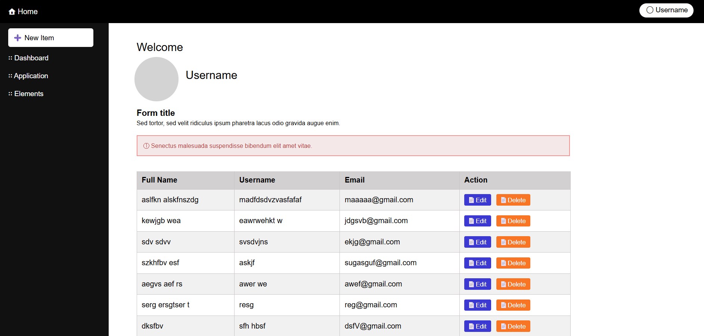
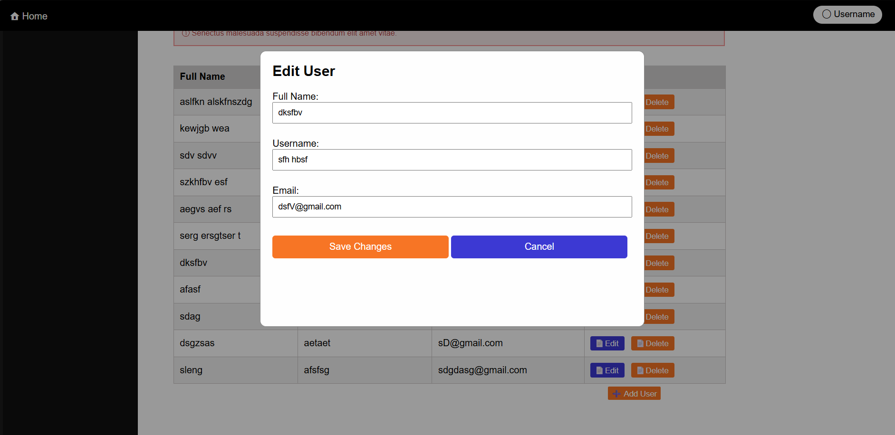
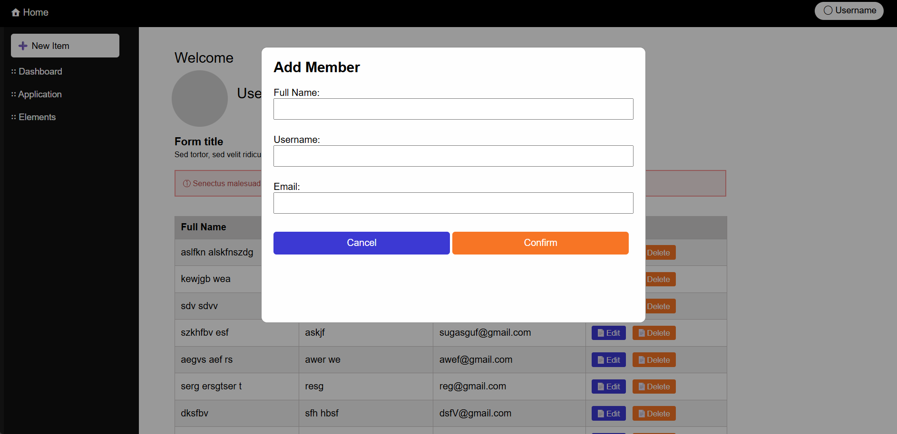

# User Management System

This is a web-based **User Management Dashboard** built using **Django**, **HTML/CSS**, and **JavaScript**. It allows you to perform CRUD operations (Create, Read, Update, Delete) on user data, including full name, username, and email. The project includes a responsive UI, modal forms, and dynamic table rendering.

## Features

- Add new users with modal form
- Edit existing user information
- Delete existing users
- Dynamic rendering of user data in table format
- Clean and responsive UI with sidebar navigation
- Built using Django views, templates, and models

## Tech Stack

- **Backend:** Django (Python)
- **Frontend:** HTML, CSS, JavaScript
- **Database:** SQLite (default for Django)

## Screenshots

### Dashboard View


### Edit User Modal


### Add User Modal


## Getting Started

### Prerequisites

- Python 3.7+
- pip

### Folder Structure
user-management-django/
├── app/                  # Django app with views, models, urls
├── templates/            # HTML templates
├── static/               # CSS/JS files
├── manage.py
├── db.sqlite3
└── requirements.txt


### Installation

```bash
# Clone the repository
git clone https://github.com/your-username/user-management-django.git
cd user-management-django

# Create a virtual environment
python -m venv venv
source venv/bin/activate    # On Windows: venv\Scripts\activate

# Install dependencies
pip install -r requirements.txt

# Apply migrations
python manage.py migrate

# Run the development server
python manage.py runserver
Visit http://127.0.0.1:8000/ in your browser.

